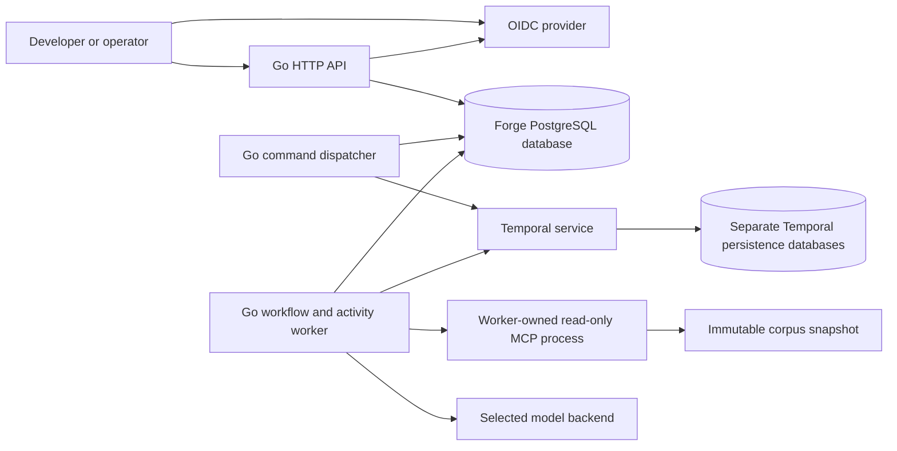

# F02 — Architecture boundaries and integration decisions

**Status:** Accepted F02 boundaries and selections, recorded on 5 October 2026.  
**Date:** 5 October 2026  
**Scope:** F01's API and durable research workflow; five project hours/week.

This document records accepted boundaries, alternatives and verification obligations. It does not claim a running platform. The owner accepted F01 with “looks good” on 5 October 2026. The owner selected the foundation, OpenRouter, Compose first/kind later, first-release Keycloak OIDC and the integration/action boundaries; selection of a free testing model was delegated. Broader environment provisioning and operational capabilities remain later releases.

## 1. First-release composition

Go exposes an authenticated HTTP/JSON API described by OpenAPI. PostgreSQL stores workload ownership, immutable versions, accepted run requests, intermediate artifacts and evidence. Temporal owns durable orchestration, task delivery, execution history and authoritative execution status. A Go worker executes bounded activities: read permitted corpus passages through MCP, call the selected model, validate references, and persist a report. A local Docker Compose runtime starts infrastructure; deployment implementation is a later task.

Arrows indicate communication, not authority. Workers poll Temporal; the API never waits for research completion. The dispatcher is a small component of the API process initially, not a new general-purpose queue service. Product and Temporal storage may share one local PostgreSQL server, but use separate databases, roles and migrations. Forge never reads or modifies Temporal's internal tables.

## 2. Responsibilities and release placement

| Component | Owns | Must not own | Release placement / alternative |
|---|---|---|---|
| Forge Go API | Input validation, authenticated identity, owner access checks, workload/version contract, run acceptance and authorized reads | Scheduling pods, implementing workflow durability, model serving | First release; HTTP/JSON instead of a public gRPC API |
| Keycloak OIDC provider | User login, issuer keys and access-token issuance | Product ownership decisions or evidence access | First release, with separate persistent identity database/role |
| PostgreSQL | Product identities, ownership, immutable workload versions, run-to-workflow mapping, durable commands, evidence/report artifacts | Workflow scheduling or a second authoritative execution state machine | First release; SQLite is simpler locally but changes the planned persistence target |
| Temporal | Workflow history, timers, bounded activity retries, task delivery, cancellation and execution status | User authentication, product ownership policy, storing the entire corpus | First release; a custom job engine would recreate selected infrastructure |
| Go worker | Deterministic workflow logic and side effects inside activities; validates tool permissions and citations | Arbitrary uploaded user code, unrestricted model-selected tools | First release; one supported research workflow type |
| MCP corpus server | Validated read/search operations over an immutable snapshot and stable passage references | Shell access, URL fetching, arbitrary filesystem paths, mutations | First release; accepted worker-owned stdio process |
| OpenRouter model adapter | Generate a report from supplied evidence under a bounded request | Authorize access, certify truth, grant new tools | First release, explicit free model; fake adapter only for deterministic tests |
| OpenTelemetry | Standard instrumentation and context propagation for requests/activities | Authoritative run history, authorization, durable audit storage | Basic correlation first; collector/dashboard stack can follow |
| Kubernetes | Schedule and reconcile container resources against declared desired state | Research-step retries, application authorization, product source of truth | Deferred; selected local kind target; managed cloud not selected |
| OPA | General policy decisions over supplied input; supports future dynamic API/tool policy | Authentication or enforcement without a caller | Deferred; initial owner checks in one tested Go policy component |
| Kyverno | Kubernetes resource/admission policy, image/resource rules | Owner-private run/evidence API policy | Deferred; preferred later cluster policy boundary, subject to that phase's ADR |
| Argo CD | Reconcile Git-declared deployment configuration into Kubernetes | Product workload version registration or asynchronous research execution | Deferred; rollout analysis requires a separate mechanism/decision |
| Standard gateway / Envoy | TLS termination, routing and transport limits when exposed | Replace object-level checks in Forge or decide tool access | Deferred; local API binds to loopback |
| Terraform | Later cloud resource lifecycle | Research workflow orchestration or product run records | Deferred; no managed cloud selected or provisioned |

The responsibilities above follow the products' official documentation; release placement and integration choices are Forge proposals. [Kubernetes components](https://kubernetes.io/docs/concepts/overview/components/), [OpenTelemetry](https://opentelemetry.io/docs/what-is-opentelemetry/), [OPA](https://www.openpolicyagent.org/docs), [Kyverno](https://kyverno.io/docs/introduction/), [Argo CD](https://argo-cd.readthedocs.io/en/stable/), [Envoy](https://www.envoyproxy.io/docs/envoy/latest/intro/what_is_envoy).

## 3. HTTP/OpenAPI versus gRPC

| Choice | Benefits for Forge | Costs and reason to choose/revisit |
|---|---|---|
| Go HTTP/JSON + OpenAPI | Straightforward curl/PowerShell examples, explicit versioned resources, documented request/response contract | Contract and implementation must be checked for drift; preferred for first release |
| Public gRPC + protobuf | Typed generated clients, streaming and RPC semantics | Adds client/code-generation/transport tooling; reconsider for a measured streaming or service-to-service need |
| Both public APIs | Supports both client families | Duplicates contracts and access/error tests; rejected at five project hours/week |

OpenAPI describes HTTP APIs; gRPC commonly uses protobuf service definitions and supports streaming. These are contract/transport options, not performance conclusions. Temporal's Go SDK can use its own gRPC transport without requiring Forge to expose public gRPC. [OpenAPI 3.1.1](https://spec.openapis.org/oas/v3.1.1.html), [gRPC introduction](https://grpc.io/docs/what-is-grpc/introduction/), [Temporal Go client](https://docs.temporal.io/develop/go/client/temporal-client).

Public routes use `/api/v1` and asynchronous run acceptance. F04 now records accepted schemas and validation in the [API contract](api-contract.md) and [OpenAPI document](../internal/contract/openapi.json). Runtime endpoints follow implementation tickets; no throughput claim is implied.

## 4. State ownership and crash-safe submission

Product identity is a Forge run ID, distinct from Temporal's Workflow ID and execution Run ID. Each accepted run freezes its workload version, corpus snapshot, permitted source scope, prompt/config version and model identifier. Ownership comes from the authenticated principal, never a client-supplied owner field.

Accepted submission boundary; exact API schemas follow in F04:

1. Validate identity, ownership, version and input. Require a client idempotency key for starting a run.
2. In one PostgreSQL transaction, insert the run request plus a pending start command. Enforce a unique `(owner, idempotency key)` constraint and retain a canonical request fingerprint. Same key/input returns the same run; changed input conflicts.
3. Return `202 Accepted` only after this transaction commits, with the run URL and submission state. This acknowledges durable acceptance, not that Temporal has started or a worker is ready.
4. A dispatcher retries the command with a stable Workflow ID derived from the Forge run ID. Reject duplicate starts; an ambiguous response triggers a lookup of that exact Workflow ID and identity before acknowledging delivery. Do not start a replacement execution with a new ID.
5. If the dispatcher crashes after Temporal accepted the start but before PostgreSQL recorded delivery, retry/lookup finds the same execution. Explicitly prevent reuse of the Workflow ID after closure; a controlled rerun gets a new Forge run and links to the original.

No PostgreSQL/Temporal distributed transaction is claimed. The pending-command record bridges the failure window; PostgreSQL is not responsible for scheduling workflow steps. Cancellation is another durable command, serialized after start delivery for that run. Repeated cancel requests are idempotent; they request cancellation, not immediate termination. A run may complete before cancellation is applied.

Temporal is authoritative for execution status after dispatch. PostgreSQL's cached status is a read projection with freshness information. If Temporal is unavailable, the API reports status uncertainty/staleness rather than manufacturing success or failure. Evidence/report persistence must finish before the workflow completes successfully; an artifact written before an activity acknowledgement is reused on retry.

Replay reconstructs deterministic workflow state from recorded history. External calls, database writes and model generation happen only in activities. Retry can execute an activity again; it is not an exactly-once guarantee. [Temporal workflow/replay](https://docs.temporal.io/workflow-execution), [Temporal activities and idempotency](https://docs.temporal.io/activities).

## 5. Research, evidence and model boundary

Accepted flow: authorize/freeze input → retrieve bounded passages → persist evidence → generate report → validate citation references → persist result. F04 records accepted tool/output schemas and bounded request values; activity retry/timeout and MCP transport implementation details still require consultation. Start with fixed retrieval and generation stages instead of an open-ended autonomous tool loop.

The corpus snapshot has a content checksum and stable document/passage IDs. Evidence records include snapshot, document, passage, text checksum and the retrieved excerpt. The MCP server accepts document IDs and scope, never arbitrary paths. The server is launched from an operator-configured command by the trusted worker, not from a workload-supplied executable. A read-only mount and allowlisted tool schema enforce the boundary; “read-only” is not trusted merely because a tool advertises it.

For local use, stdio avoids exposing another server port; Streamable HTTP is the alternative if remote MCP deployment later becomes necessary. MCP defines both transport mechanisms. [MCP transports](https://modelcontextprotocol.io/specification/2025-06-18/basic/transports).

All initial owners may use the same synthetic/public corpus; run histories and retrieved evidence records remain owner-private. The worker validates the stored owner/scope before activities and denies missing records. Retrieved text and model output are untrusted data: neither may alter credentials, tool permissions or source scope. No browser, network-search tool, shell or model-generated tool name is executed.

Citation validation checks references against the retrieved snapshot/passages and verifies stored hashes. This proves reference integrity, not that a cited passage logically supports every claim. Answerable, unanswerable and conflicting-evidence fixtures plus human review test support and uncertainty. Invalid references produce an inspectable failure; there is no unlimited “repair until valid” loop.

Each activity persists successful output under a unique `(run, logical step)` key, after verifying its input fingerprint. Retries reuse committed output. A crash after the model generated output but before persistence may cause another generation and another charge. Temporal replay does not recover an unrecorded provider response. Bound retries and record this limit rather than claiming exactly-once inference.

## 6. Security and deployment envelope

The first runtime is a trusted operator's local installation. Developers access the Forge API, not PostgreSQL, Temporal's UI/API or worker credentials. Shared processes/databases are not a sandbox against hostile submitted programs; arbitrary workload code is unsupported. Host administrators can inspect local data. The system demonstrates API ownership enforcement within that envelope.

The owner selected **Keycloak OIDC from the first release**, running in Compose with a separate persistent identity database/role. Use two developer identities and one operator. Login uses authorization code with PKCE; the API accepts access tokens, not ID tokens. Validate configured issuer, API audience, signature using trusted issuer keys, expiry and allowed algorithms; reject client-supplied role/owner fields and untrusted key URLs. Ownership is keyed by the validated issuer/subject, not a mutable email or display name. Map only configured provider role claims to developer/operator actions. Secrets and tokens remain outside Git, artifacts and telemetry. OIDC authenticates identity; Forge still performs every object-level access check. Exact client/claim configuration, token acquisition helper, token/revocation semantics during an accepted run and library selection are implementation-task decisions. [OIDC Core](https://openid.net/specs/openid-connect-core-1_0.html), [Keycloak container setup](https://www.keycloak.org/server/containers).

OIDC adds one identity service and bootstrap/client setup to the first release. Include it in the revised estimates and quickstart; first-release authentication is no longer a static-token placeholder. The issuer URL must be consistent for the host client and container API; do not fix container networking by disabling issuer validation. Keycloak's development-mode shortcuts are local-development only, not a production deployment configuration.

Accepted action boundary (OIDC selected by the owner):

| Action | Developer | Operator |
|---|---|---|
| Register workload/version; submit run | Own workloads only | No cross-owner mutation |
| Read/list workload, run, history, error or evidence | Own records only | All owners, for inspection |
| Cancel or controlled rerun | Own runs only | No cross-owner mutation |
| Delete records, transfer ownership, arbitrary tool execution | Unsupported | Unsupported |

Collection queries and nested evidence/history endpoints enforce the same policy. Unauthorized object IDs must not reveal another owner's existence. Infrastructure access is privileged operator access; Temporal namespaces and PostgreSQL databases are not substitutes for these application checks. PostgreSQL RLS could later provide defense in depth, but table-owner/bypass behavior and pooled connection context require deliberate testing. [PostgreSQL row security](https://www.postgresql.org/docs/current/ddl-rowsecurity.html).

Use persistent volumes for local PostgreSQL and Temporal backing storage; container recreation must not erase accepted runs. Local deployment has no high availability promise. Temporal's durable service configuration must be distinguished from an ephemeral development server. Versions/images will be pinned and validated when the runtime is implemented. [Self-hosted Temporal](https://docs.temporal.io/self-hosted-guide).

Emit request/run/step/attempt correlation and structured error codes. Omit credentials, raw prompts and corpus text from routine telemetry. Telemetry loss must not change execution correctness. Activity timeouts, retry limits, request-size limits and concurrency settings are explicit implementation parameters; numerical performance/recovery acceptance follows F08, not guesses in this ADR.

## 7. Model and cloud decision record

The owner selected **OpenRouter** and **local Kubernetes** on 5 October 2026. A managed cloud target is intentionally deferred: the original cloud-selection criterion is amended by that explicit owner instruction. Docker Compose first and kind later were accepted in the follow-up consultation. The owner requested a free model for testing; **`google/gemma-4-26b-a4b-it:free`** is selected within that delegated scope.

Call OpenRouter's HTTP chat-completions API through a narrow Go adapter. Use the explicit model slug, no automatic model fallback and no paid plugins/server tools. The worker invokes MCP itself. Restrict requests to the currently listed `google-ai-studio` endpoint with provider fallback disabled, and request `provider.data_collection: "deny"`. If no permitted free route remains, report the dependency failure; do not relax data policy or switch to a paid model silently. Verify the route with the owner's account at implementation time: public metadata did not establish that this endpoint meets the filter. Only synthetic/public questions and corpus fixtures are allowed; no provider privacy guarantee is claimed. [OpenRouter quickstart](https://openrouter.ai/docs/quickstart), [provider routing](https://openrouter.ai/docs/guides/routing/provider-selection), [provider data policies](https://openrouter.ai/docs/guides/privacy/provider-logging).

The live public catalog and endpoint API on 5 October 2026 listed zero prompt/completion prices for this exact free slug. The model supports JSON output but does not advertise enforced JSON schemas on its free model page; Forge must validate its own report schema and citations. Account/provider rate limits and availability still apply. Tests use a deterministic fake model for failure injection and limited live smoke checks later; live free-model throughput is not a platform capacity guarantee. [Selected model](https://openrouter.ai/google/gemma-4-26b-a4b-it:free), [live model catalog](https://openrouter.ai/api/v1/models), [free variants](https://openrouter.ai/docs/guides/routing/model-variants/free), [rate limits](https://openrouter.ai/docs/api_reference/limits).

| Alternative | Cost / data implications | Reversibility |
|---|---|---|
| OpenRouter free variant (selected) | Currently $0 token price; supplied excerpts leave the PC; free-tier availability/rate limits | Small provider adapter; outputs and evaluation vary when changed |
| Paid hosted model | Usage charges; possible better availability; not selected and no automatic fallback | Change explicitly after owner approval and repeat evaluation |
| Local Ollama | Local compute, memory, disk and model-license constraints; can avoid external corpus transfer with a local model | Replace adapter and rerun evidence/quality/latency tests |
| Self-hosted vLLM | Own model-serving capacity/operations; unnecessary for this release | More serving infrastructure; defer |
| AWS EKS (alternative, not selected) | Managed Kubernetes plus compute, storage, networking and model/database costs | Portable Go/SQL/Temporal boundaries; IAM/network/Terraform configuration is cloud-specific |
| GCP GKE (alternative, not selected) | Similar separate infrastructure costs; eligible free-tier credit can reduce management fees | Rework cloud infrastructure/identity, not the product API |

Local Kubernetes is the selected deployment target; kind is selected for reproducible development clusters. There is no managed-cluster charge for kind itself, but it uses the PC's resources and provides no cloud availability guarantee. Docker/runtime installation and persistent-volume behavior must be validated when deployment is implemented. [kind quickstart](https://kind.sigs.k8s.io/docs/user/quick-start/).

Ollama provides a local model API; it is an alternative, not a second installed backend. [Ollama API](https://docs.ollama.com/api/introduction).

Pricing checked 5 October 2026: EKS standard support is $0.10/cluster-hour, about $73 at 730 hours; extended support is $0.60/hour. GKE lists $0.10/cluster-hour and an eligible monthly free-tier credit. Neither figure is a full-stack estimate. Nodes, volumes, load balancers, egress, database/Temporal operation and taxes are additional. Recheck region/support/eligibility when planning an actual deployment. [EKS pricing](https://aws.amazon.com/eks/pricing/), [GKE pricing](https://cloud.google.com/kubernetes-engine/pricing).

F02 provisions nothing and incurs no model-call charges. At the listed zero token price, token cost is zero for successful calls and retries to the selected free route; capacity and eligibility are still constrained. Any future paid cost estimate must include repeated attempts and ancillary fees, not only successful runs. Local PostgreSQL, Temporal and Keycloak consume hardware/energy/storage and operator time. A cloud region, spend ceiling, retention policy and operational database strategy require owner decisions if cloud deployment is resumed. No budget or permission to buy credits is inferred from the choice of provider.

## 8. Why there is no Redis or additional broker

Temporal delivers workflow/activity tasks; PostgreSQL records the small durable start/cancel handoff. There is no demonstrated cache, pub/sub or independent event-stream requirement. Redis, SQS, Kafka and a second workflow framework add operations and failure boundaries without solving an accepted first-release requirement. Revisit only with a concrete consumer, delivery semantics and measurements that justify the dependency.

## 9. Verification obligations for implementation

| Scenario | Required observable result |
|---|---|
| Same idempotency key concurrently; then changed input | One logical run; changed input conflicts |
| Crash after PostgreSQL commit before start | Pending command survives; same workflow starts after recovery |
| Crash after Temporal start before command acknowledgement | Retry discovers original execution; no duplicate logical workflow |
| Cancel while start is pending; repeat cancel; completion race | Durable ordered request; explicit eventual outcome |
| Worker restart and transient MCP/model failure | Recorded steps survive; bounded retries, inspectable attempts |
| Crash after artifact persistence before activity acknowledgement | Retry reuses output; no duplicate logical artifact |
| Model reply received but not persisted | Possible repeated inference documented and tested with a fake backend |
| Forged/expired/wrong-issuer/wrong-audience tokens; other-owner direct/nested/collection access and operator mutations | Owner privacy and the exact action matrix enforced |
| Invalid citation, insufficient/conflicting evidence, path traversal | Valid references or explicit failure/uncertainty; no arbitrary file access |
| Temporal unavailable while reading status | Dependency error/stale projection exposed; no fabricated terminal state |

These are future behavioral tests, not claims of passing tests in F02. API/workflow implementation will convert them into runnable checks. Performance targets remain deferred to F08. No code/runtime test is meaningful for this documentation-only task.

## 10. F02 acceptance evidence

- [x] HTTP/OpenAPI and gRPC compared; every named infrastructure responsibility mapped.
- [x] Owner accepts integration and access boundaries; Keycloak OIDC selected from the first release.
- [x] Free OpenRouter testing model selected under owner delegation; local Kubernetes timing accepted; cloud criterion amended by owner and alternatives/costs recorded.
- [x] Redis/additional queue require a demonstrated need.
- [x] ADR records that Forge composes Backstage/Kubernetes/Temporal/model serving and omits a polished chat UI.
- [x] Documentation links checked and owner responses recorded; this reviewed change is the F02 commit.

Architecture records: [0001 — Build boundaries](adr/0001-compose-existing-infrastructure.md), [0002 — API and state ownership](adr/0002-api-state-and-durable-execution.md), [0003 — Trust and research boundary](adr/0003-local-trust-and-research.md), [0004 — Model and cloud](adr/0004-model-and-cloud.md).
